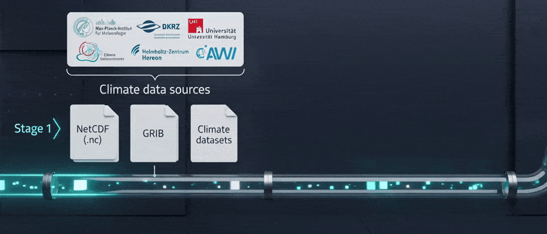

{ width="900" .img-center }

/// caption
Explore the HEALPix data hub with the STAC Browser.
///

The same holdings as the Data Browser, presented as SpatioTemporal Asset
Catalog collections and items. Every dataset is an analysis-ready, cloud
optimized HEALPix Zarr pyramid served from S3.

Licensed CC-BY-4.0.
