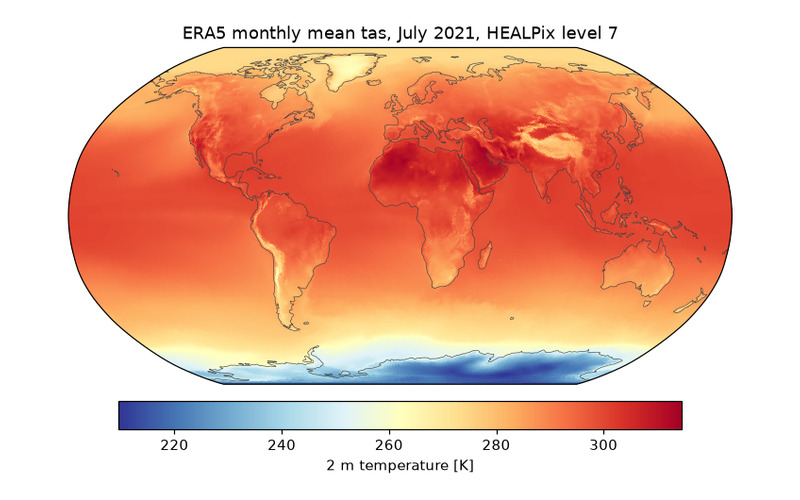
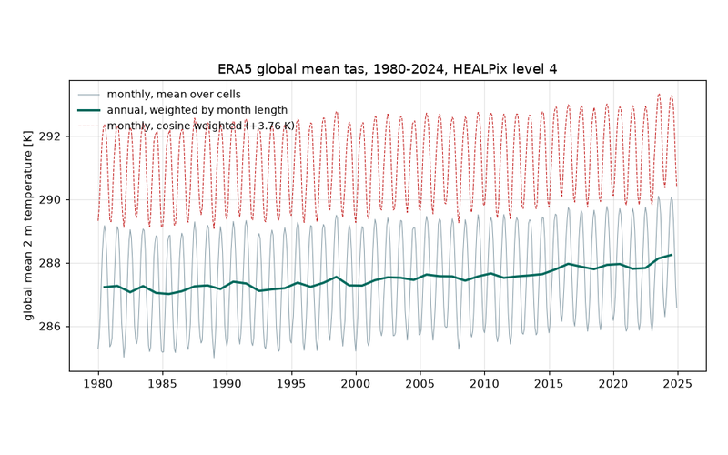
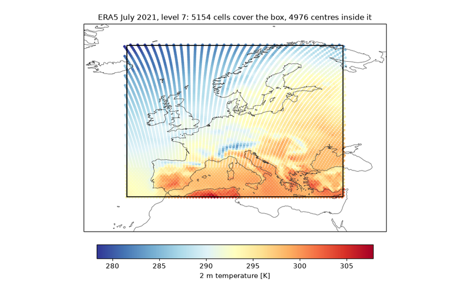
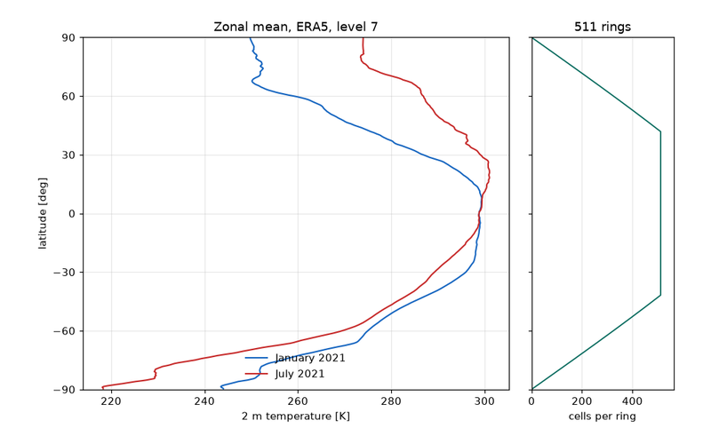
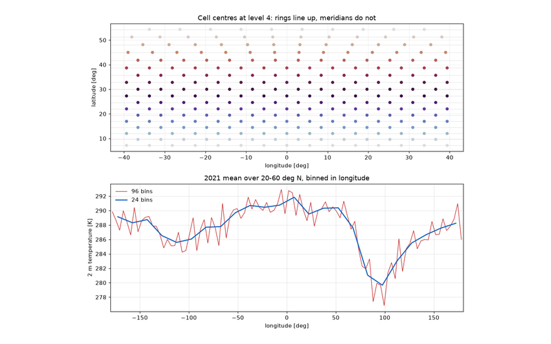
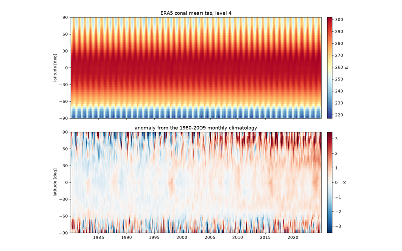
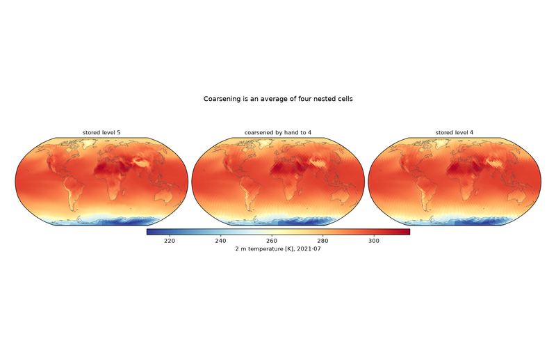
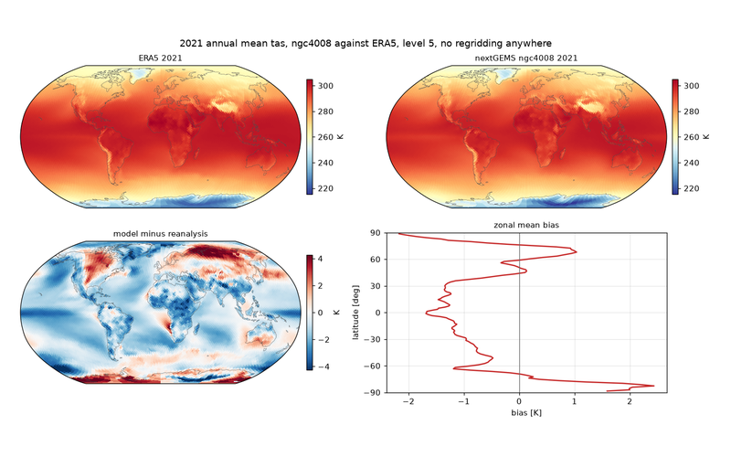

Below you can find short, complete examples that do something useful with the
data in the hub. Browse through them and select the example you are interested
in. Every one of them runs on its own against the public endpoint, needs no
credentials, and finishes in seconds, because they all work at coarse pyramid
levels where a global field is a few tens of kilobytes.

They are also a HEALPix tutorial in disguise. The grid makes some things
easier than a lon/lat grid does and a few things harder, and the examples are
ordered so that each one introduces exactly one of those.

:::tip[Run them here, in your browser]
Every code block on the example pages has a **Try in Python** button. Press it
and the code runs in this page, against the live hub: nothing to install, no
account. The blocks on a page share one Python session, like notebook cells,
so run them in order. `healpix-geo` comes preinstalled. Edit any of them
and run it again.

Prefer your own machine? Each page offers its script and
[`requirements.txt`](/downloads/examples/requirements.txt) as a download.
:::

[//]: # "examples-cards:start"

-   

    **[A map of one month](./01_first_map.md)**

    The first thing anybody wants from a dataset is to look at it. On a HEALPix store that takes one more step than on a lon/lat grid, because the data has no lon/lat axes to hand `pcolormesh` and no two-dimensional shape at all. A field is a flat vector over cells, and the geometry lives in the cell index rather than in the array shape.

-   

    **[The global mean is just a mean](./02_global_mean.md)**

    On a regular lon/lat grid, averaging a field over the globe is a small trap with a well known fix: cells near the poles are narrow, so you weight by the cosine of latitude before you average. Forget it and your global mean temperature comes out several kelvin too cold, because you counted the Arctic as though it were as large as the tropics.

-   

    **[Cutting out a region](./03_region_bbox.md)**

    `ds.sel(lat=slice(35, 70), lon=slice(-15, 35))` is the line everybody reaches for first, and on a HEALPix store it raises. There is no `lat` dimension to slice. There is one horizontal dimension, `cell`, and its index encodes position in a way that a slice object knows nothing about.

-   

    **[Zonal means come for free](./04_zonal_mean.md)**

    Grouping a floating point coordinate is normally a mistake. You bin, you argue about bin edges, and you accept that the answer depends on the argument.

-   

    **[Meridional means, and why they are harder](./05_meridional_mean.md)**

    The previous example got a zonal mean for nothing, because HEALPix is built out of rings of constant latitude. It is tempting to assume the transpose works too, and that averaging along a meridian is equally free.

-   

    **[A Hovmöller diagram](./06_hovmoeller.md)**

    A Hovmöller plot collapses one space dimension and keeps time, which makes it the natural next step once zonal means work. It is also where picking the right corner of the pyramid stops being an optimisation and starts being the difference between a figure and a coffee break.

-   

    **[Moving up and down the pyramid](./07_pyramid_levels.md)**

    Every dataset on the hub is stored as a pyramid: the same field written out at a series of HEALPix levels, each one four times coarser than the last. Choosing a level is normally all you need to do, and the number in the URL is the whole of the API.

-   

    **[Comparing two datasets without regridding](./08_cross_dataset.md)**

    This is the example the hub exists for.

[//]: # "examples-cards:end"

## Where to go next

The examples stay at coarse levels to stay fast. For the regional stores at
levels 16 and above, where the full cell axis cannot be held in memory at all
and every selection has to be index-driven, see
[Tips and tricks](../tips-and-tricks/working-with-data.md).
