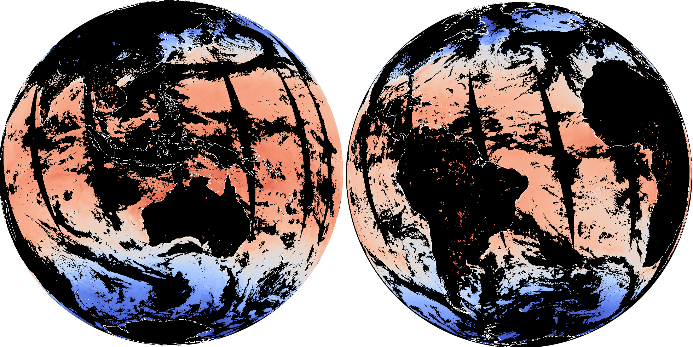

**Reanalyses, climate model output, campaign data and satellite products, all on
the same grid: the data pool, with slides to every level.** The
[home page](/) lists the published collections; this is where the
documentation starts.

{ width="600" .img-center }

/// caption
Sea surface temperature seen by MODIS AQUA, remapped to HEALPix level 10.
///

### Cross dataset comparison is easy and intuitive, no regridding

```python
import xarray as xr

S3 = {"anon": True, "endpoint_url": "https://s3.waterpark.dkrz.de"}

era5 = xr.open_zarr(
    "s3://reanalysis/healpix/era5/P1M/level_5.zarr", storage_options=S3, chunks=None
)
model = xr.open_zarr(
    "s3://nextgems/healpix/ngc4008/P1D/level_5.zarr", storage_options=S3, chunks=None
)

bias = (
    model["tas"].sel(time="2021").mean("time")
    - era5["tas"].sel(time="2021").mean("time")
)
```

Paths are `<project>/healpix/<dataset>/<frequency>/level_<n>.zarr`. Every
dataset is written at a range of levels and frequencies; develop against a
coarse monthly store, then change two numbers in the URL.

<div class="grid cards cols-2" markdown>

-   **[Find a dataset](/databrowser/)**

    Search by dataset, variable, level and frequency, and copy the store URL.

-   **[Walk the catalogue](/stac-browser/)**

    The same holdings as STAC, for tools that already speak it.

-   **[Learn by example](./examples/index.md)**

    Eight short programs, one plot each, from a first map to a cross-dataset
    comparison.

-   **[Read the guide](./tips-and-tricks/working-with-data.md)**

    Chunking, regional selection at high levels, and the usual mistakes.

</div>

## What you can count on

- **No regridding.** Everything is HEALPix, nested, on one sphere.
- **Equal-area cells.** A global mean is `field.mean("cell")`, no `cos(lat)`.
- **Read only what you need.** Zarr chunks over HTTP.
- **A pyramid in space and time.** Coarse and monthly, or fine and hourly.
- **No mounted filesystem.** The same URL from a laptop, Levante or a batch job.

## How it got this way

Each source grid is remapped once, conservatively, with
[`grid-doctor`](https://github.com/freva-org/grid-doctor). Coarser levels come
from hierarchical coarsening rather than from remapping again.

[Why HEALPix?](./storage-concepts/why-healpix.md) ·
[Why Zarr and S3?](./storage-concepts/zarr-and-s3.md) ·
[Remapping decisions](./storage-concepts/technical-decisions.md) ·
[Benchmark](./storage-concepts/remapping-benchmark.md) ·
[Operator Tools](./operation/tools.md)

## Status

A prototype. The interface is meant to stay stable, but data still comes from
DKRZ file systems through an S3-compatible gateway rather than dedicated object
storage.
