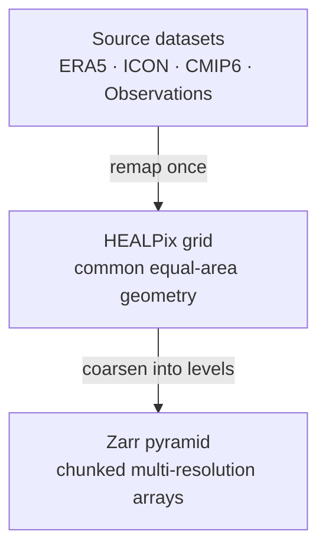

This section explains the key storage and access decisions behind Waterpark.

Waterpark combines three ideas: a common **HEALPix grid**, chunked **Zarr**
datasets, and **S3-compatible object storage**. Together, these choices make
climate and Earth observation data easier to compare, easier to stream, and
easier to use in interactive analysis or machine-learning workflows.

They are explained in two parts, in order. We first explain why Waterpark remaps
datasets to HEALPix, a hierarchical equal-area grid that provides a common
geometry across very different source datasets. We then describe why the data is
stored as Zarr pyramids and why this format works especially well when served
from an S3 object store.

The two arrows in that diagram are the two parts. The first is a geometry
problem, the second an access problem, and they are solved by different things.

### Part 1 — Why HEALPix?

The common-grid problem: equal-area pixels, the nesting hierarchy, and the
poles. [Read part 1](./why-healpix.md).

### Part 2 — Why Zarr and S3?

The access problem: chunking, lazy partial reads, and why object storage suits
this shape of data. [Read part 2](./zarr-and-s3.md).

### Background

How the conversion itself is done: the [remapping decisions](./technical-decisions.md)
behind the pipeline, with references, and the
[remapping benchmark](./remapping-benchmark.md) on MODIS-AQUA.
